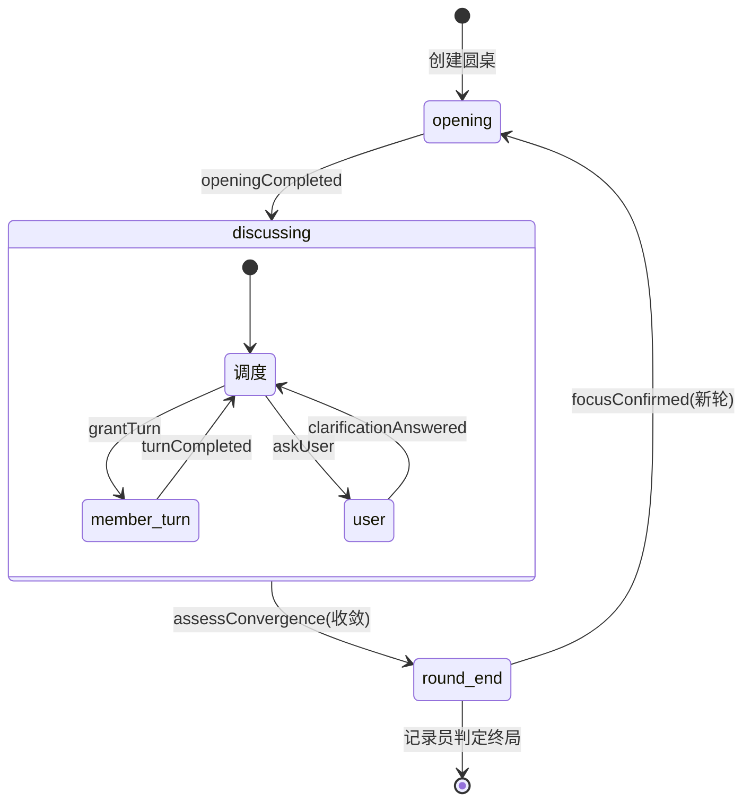
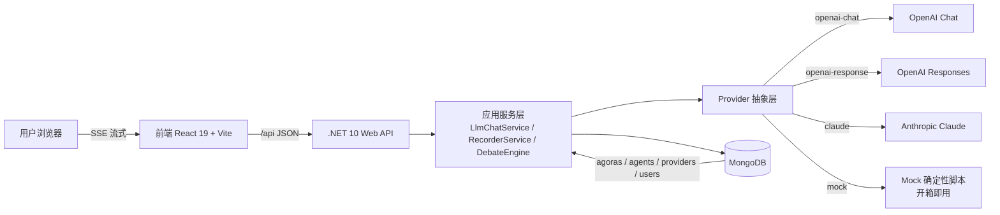

# The Agora｜信息门约束的多智能体讨论协议

> 多智能体协作中，成员之间传递完整上下文会导致注入内容随轮次膨胀，并使讨论趋向于人云亦云。本文提出**信息门约束的多智能体讨论协议**：成员互不可见原始发言，仅通过公共板交换结构化立场并相互挑战；全部行为由文本协议伪 FunctionCall 驱动，跨 OpenAI Chat、OpenAI Responses、Anthropic Claude 与 mock 四类协议一致。

---

## 1. 问题

单个大语言模型（LLM）的推理能力已接近特定领域的专家水平，但其产出仍来自单一视角，难以自我识别假设中的缺陷。多智能体辩论等方法通过多实例辩论显著提升了推理质量，但现有实践多为研究者自建流程：AutoGen、MetaGPT 等框架提供编排原语，讨论组织、上下文传递与收敛判定依赖开发者自行设计，成员之间常传递完整发言，注入内容随轮次膨胀，讨论易陷入人云亦云。

针对上述问题，本文提出信息门约束的多智能体讨论协议（Information-Gated Deliberation Protocol）。协议以信息约束为第一原则：成员互不可见原始发言，仅通过公共板（Board）交换结构化立场，可见上下文由议题块、立场摘要与定向附带三部分组成；会议主持由后端状态机化的记录员（Recorder）承担，负责放行发言、合并澄清、路由挑战与判定收敛；全部行为由文本协议伪 FunctionCall 驱动，跨 OpenAI Chat、OpenAI Responses、Anthropic Claude 与 mock 四类协议一致。The Agora 是该协议核心讨论引擎的一个实现。

本文的主要贡献如下：

1. **信息门约束的讨论协议**：定义成员可见上下文的有界构成，使注入内容随轮次线性增长，从协议层面约束多智能体讨论中的上下文膨胀。
2. **可断点续跑的状态机执行引擎**（DebateEngine）：将会议调度、澄清合并、挑战路由与收敛判定形式化为确定性状态机，每次推进为纯状态函数，每步落库，断网或刷新不丢失进度。
3. **跨协议统一的驱动机制**：采用文本协议伪 FunctionCall 作为统一行为驱动，使协议实例可跨四类 LLM 协议一致执行；规则层前置削减调用成本，确定性降级保证流程稳定。

### 1.1 与现有方案的差异

| 维度     | 单模型助手 | 编排框架（AutoGen / CrewAI） | 本协议               |
| ------ | ----- | ---------------------- | ----------------- |
| 讨论组织形式 | 无     | 开发者自行编排                | 状态机内建             |
| 成员上下文  | 单轮输入  | 常传递全文，随轮次膨胀            | 议题块 + 立场摘要 + 定向附带 |
| 主持人    | 无     | 无                      | 记录员（Recorder）     |
| 输出形态   | 单轮回答  | 由开发者流程决定               | 结构化公共板 + 轮次总结     |

信息约束的依据来自一个基本观察：讨论中过度暴露信息会产生两类问题——一是上下文随轮次膨胀，二是成员倾向于复制他人论述而非独立推理，即回声室效应。据此提出假设：限制成员可见信息能够提升讨论质量。实现该假设的方式是信息门，其规则见下节。

---

## 2. 方案

### 2.1 信息门：角色可见性

信息门规定各角色的可见范围。**成员是唯一受约束的角色。**

| 角色  | 可见                       | 不可见            |
| --- | ------------------------ | -------------- |
| 成员  | 议题块 + 公共板立场摘要 + 定向附带     | 其他成员原始发言、挑战中间态 |
| 记录员 | 公共板 + 成员全文 + 决策日志 + 未决队列 | —              |
| 用户  | 公共板 + 成员可展开的完整论述         | —              |

成员每次发言时，后端将上下文组装为三个部分的并集：

> **C(m) = I(topic, focus, background, goal, constraints) ∪ S(公共板立场摘要) ∪ A(定向附带)**

其中定向附带是唯一的上下文注入通道：被点名反驳时附对方原话，澄清作答时附用户答案，事实核实时附核实结果。公共板只发布压缩立场，完整论述仅在被点名时定向下发，因此**单个成员的上下文不随其他成员发言增长**。

---

## 3. 执行引擎

### 3.1 记录员状态机

讨论推进由记录员状态机承担。会议阶段（phase）取值包括 `opening`、`discussing`、`round_end` 与 `meeting_end`，未开场时为空。状态机对外仅暴露推进端点，每次调用执行一次 Step 操作：

> **Step(agora, event) = 读会话 → 应用事件 → 记录员决策循环（上限 8 次）→ 执行内部动作 → 停于挂起点 → 落库返回**



前端通过回报事件驱动推进：`openingCompleted`（开场完成）、`turnCompleted`（成员发言完成）、`focusConfirmed`（聚焦确认）、`clarificationAnswered`（澄清作答）；事件与当前阶段不符时返回校验错误。

**挂起点语义**

| wait          | 触发条件                | 前端动作           |
| ------------- | ------------------- | -------------- |
| `opening`     | 未开场且无事件             | 对全员并发发起开场发言    |
| `member_turn` | 记录员 grantTurn 放行某成员 | 对该成员发起流式发言     |
| `user`        | 记录员 askUser 统一提问    | 弹窗等待用户作答       |
| `round_end`   | 本轮收敛、总结已落库          | 展示总结，确认或编辑下一聚焦 |
| `meeting_end` | 记录员判定议题终局           | 展示最终结论         |

### 3.2 讨论范式抽象

协议将调度逻辑抽象为讨论范式接口（`IDiscussionParadigm`），以便为消融实验提供干净的隔离变量：**记录员主持**为默认实现（LLM 动态调度），**轮转范式**（RoundRobin）为确定性第二实现（有未发言成员 → 放行首位；全员发言 → 最小总结，决策伪装为 ToolCall 经引擎同一 switch 执行，保证状态机一致）。两种范式均已实现并可按会话配置切换。

无论采用何种范式，信息门上下文组装保持不变，且信息门本身可开关（关闭时成员可见彼此完整立场），为消融实验提供隔离变量。

---

## 4. 行为驱动

### 4.1 文本协议伪 FunctionCall

协议要求全部行为由模型输出的 JSON 工具调用契约驱动，格式为 `{"tool":"xxx","args":{}}`。

**成员工具契约**

| 工具                     | 参数                                                           | 触发时机                   |
| ---------------------- | ------------------------------------------------------------ | ---------------------- |
| `submitStance`         | coreClaim, reasoning[], evidence[], softSpots[], confidence? | 开场 / 被点名重述，产出结构化立场     |
| `requestChallenge`     | targetId, direction, why, how                                | 反驳 / 质疑 / 补充 / 要求举证    |
| `requestClarification` | question, options[]                                          | 关键事实缺失，需询问用户           |
| `requestFactCheck`     | claim, sources?[]                                            | 主张需外部核实                |
| `callTool`             | toolId, params                                               | 需要外部数据（搜索/新闻等 HTTP 工具） |

**记录员工具契约**

| 工具                    | 参数                                 | 语义                   |
| --------------------- | ---------------------------------- | -------------------- |
| `grantTurn`           | memberId, turnKind, attach?        | 放行成员发言，附定向上下文        |
| `askUser`             | question, options[], audience[]    | 向用户统一提问并挂起           |
| `mergeClarifications` | newQuestion, options[], mergeIds[] | 相近澄清合并为一次提问          |
| `dismissChallenge`    | challengeId, reason                | 判定重复或无新意，拒绝上板        |
| `assessConvergence`   | —                                  | 判定本轮是否收敛             |
| `endRound`            | summary, nextFocus                 | 写轮次总结，提议下一聚焦         |
| `endMeeting`          | finalVerdict                       | 判定议题终局               |
| `submitConclusion`    | answer, confidence?                | 输出圆桌最终结论（决策协议，答案归一化） |

成员产出 `submitStance` 后，后端解析并直接上板，不经过 LLM 提炼；产出 `requestChallenge` 或 `requestClarification` 后，先经规则层校验再决定上板或入队。成员产出 `callTool` 后，后端按配置执行 HTTP 工具（方法 / URL / 请求头 / 请求体，`{参数名}` 由成员传入参数与全局参数替换），结果以【工具结果】注入成员上下文并继续发言，单次发言内工具调用硬性限制为 3 次，达到上限后注入提示强制产出立场（确定性降级防止工具无限循环）；工具结果按 `maxOutputSize` 截断，防止上下文爆炸。

**示例：submitStance**

```json
{ "tool": "submitStance", "args": { "coreClaim": "应先验证市场再扩团队", "reasoning": ["需求未充分验证"], "evidence": ["早期调研数据"], "softSpots": ["样本有限"] } }
```

**示例：requestChallenge**

```json
{ "tool": "requestChallenge", "args": { "targetId": "m2", "direction": "质疑", "why": "样本是否代表目标用户", "how": "补充验证渠道" } }
```

### 4.2 决策协议

讨论的最终结论由决策协议产出（`submitConclusion`）：**记录员裁决协议**由记录员依据板上立场输出最终答案与置信度；**投票协议**对成员上报的答案选项做归一化（纯字母 A/B/C/D 或纯数字，解析失败弃票）后多数决。记录员判定终局（`endMeeting`）时触发决策协议，结论（归一化答案 + 原始答案 + 置信度 + 选票）随会话落库，供报告与基准评估提取答案。

### 4.3 成本控制与稳定性

记录员每次决策的上下文被限定在约 1k tokens 的预算内，使决策成本不随轮次增长。

| 组成                                  | 预算           |
| ----------------------------------- | ------------ |
| 议题块                                 | 约 200 tokens |
| 公共板立场摘要（每人 coreClaim + 前 2 条理由，6 人） | 约 360 tokens |
| 未处理挑战                               | 约 100 tokens |
| 最近决策日志 5 条                          | 约 200 tokens |

并非每次调度均调用 LLM。挑战去重、配额（每轮每成员最多发起 3 次挑战、被点名发言不超过 6 次）与阶段校验等确定性判断在规则层完成，仅真正需要判断的决策交由记录员 LLM。记录员超时或输出非法 JSON 时，确定性降级路径接管：存在未处理挑战则放行第一个，无其他动作则结束本轮并写入最小总结。

---

## 5. 系统实现

### 5.1 总体架构

The Agora 采用 Monorepo 组织，前端与后端分置于 `apps/web` 与 `apps/api`，共享同一份 API 契约。整体数据流为一条贯穿浏览器至 AI 提供商的流式管道。



| 层     | 技术                                                                                   |
| ----- | ------------------------------------------------------------------------------------ |
| 前端    | React 19 · Vite · TypeScript · TailwindCSS v4 · React Query · Zustand · React Router |
| 后端    | .NET 10 · Clean Architecture（Api / Application / Domain / Infrastructure）            |
| 存储    | MongoDB（会话状态随圆桌原子落库）                                                                 |
| AI 接入 | 四协议 Provider 抽象：openai-chat / openai-response / claude / mock                        |

### 5.2 后端实现

后端按 Clean Architecture 分为四层，依赖方向由外向内：

```
apps/api/
├── Agora.Api             # 控制器 + SSE 基类 + 全局异常处理
├── Agora.Application     # 服务层：LlmChatService / RecorderService / DebateEngine…
│   ├── Abstractions      #   接口（仓储 / Provider / 密码 / Token）
│   └── Contracts         #   DTO 契约
├── Agora.Domain          # 领域实体：AgoraSession / Board / Agent…
└── Agora.Infrastructure  # MongoDB 仓储 + Llm Providers + Security
```

Api 层仅处理 HTTP 语义（路由、SSE 流、异常映射）；Application 层承载业务编排；Domain 层为纯数据实体，无外部依赖；Infrastructure 层为适配器，MongoDB 仓储、四个 Provider、JWT 与密码哈希均通过接口向上暴露。

AI 接入抽象为 Provider 层。接口 `ILlmProvider` 提供非流式 `ChatAsync` 与流式 `StreamContentAsync`，后者逐段产出文本增量。三个 HTTP 协议适配器共享基类，统一处理 URL 规范化、密钥校验、系统提示词组装与 SSE 流解析：OpenAI 兼容协议以 `[DONE]` 帧终止，Anthropic 以 `message_stop` 事件终止。mock 协议不发起 HTTP 请求，由确定性脚本按会话状态驱动输出，与真实协议共用同一解析器与工具契约。

成员回答、记录员总结与记录员对话均经 SSE 逐段下发，前端各成员格独立消费，结束后以 `done` 事件收尾。后端编排的整轮问询将一轮并发流式与落库收敛至单个端点，一轮仅两次数据库写入。全链路 JSON 一律 camelCase，前后端字段大小写一致。

### 5.3 数据模型

系统使用 MongoDB 作为唯一持久化存储。

| 集合              | 用途                                  |
| --------------- | ----------------------------------- |
| `users`         | 邮箱、密码哈希（bcrypt）、角色                  |
| `agents`        | 成员配置：名称、角色、描述、系统提示词、温度、启用状态         |
| `llm_providers` | 供应商多实例与模型清单（id、displayName、enabled） |
| `agoras`        | 圆桌会话：议题输入、成员列表、问答进度、记录员总结           |
| `prompts`       | 运行时提示词（默认值集中管理，库值优先、缺省回退）           |

成员与供应商均为数据配置���非代码实现。成员为入库配置行（种子含 6 位默认成员），人格、提示词与温度可在管理页调整，亦可通过 `POST /agents/generate` 由 AI 依据描述生成新成员并落库。供应商为多实例加模型清单，每家有独立 BaseUrl、密钥与模型配置，可拉取真实模型列表并设置显示名；Agent 经 `providerId` 绑定，未绑定时按协议回退至第一个启用供应商。

`agoras` 为嵌入式文档聚合根，`board`、`recorderLog`、`phase`、`round` 均内嵌于会话文档，随文档整体更新，具备原子性，无需跨集合事务。断点续跑基于每步落库：以整轮并发问询为例，`POST /agoras/{id}/ask` 仅执行两次写入，先建进度条目（全 pending），并发流式全部成员，终态一次性写回；DebateEngine 每次 step 结束落库，返回的 `wait` 字段指示前端暂停位置，前端据此恢复发言、弹窗或总结，刷新与断网均不丢失进度。

### 5.4 前端实现

前端按状态生命周期拆分业务状态，轮次循环的关键可变量以 ref 镜像，防止异步续跑读取到过期状态。

| 模块                 | 职责                                      | 生命周期  |
| ------------------ | --------------------------------------- | ----- |
| AgoraDetail（页面组件）  | 会话级状态：成员排序、尺寸、模型覆盖、澄清队列                 | 整个会话  |
| useRoundLoop       | 轮次循环：activeQuestion、round、自动/手动、records | 轮次间   |
| useParallelChat    | 整轮并发提问与流式：ask()、busy、allAnswered        | 单轮内   |
| useModelAssignment | 成员格与模型的绑定                               | 会话内可变 |

SSE 事件携带 `agentId`，分发至每格独立的流式状态机；`busy` 状态由在途请求数驱动，`allAnswered` 标记所有成员进入终态，用于触发记录员与下一轮。多位成员可同时提出澄清请求，前端维护澄清队列与进度统计，逐个作答后按 `agentId` 回填重发。成员与记录员模块高度锁定于视口内并内部滚动，总高度不超过 100vh，保证多成员并发展示时界面不出现整体滚动。

---

## 6. 实验评估

本节以客观、可复现的方式评估协议的核心主张：多智能体圆桌讨论在客观准确率上不劣于单模型，同时额外提供可审计的结构化决策过程，而信息门显著降低成员可见的上下文成本。实验全部使用 DeepSeek V4 Flash，成员配置 5 角色（梦想家 / 质疑者 / 产品经理 / 投资人 / 用户），全程记录真实 token 用量与中间状态。

### 6.1 设置与指标

- **数据**：15 道客观多项选择题，覆盖数学、化学、天文、地理、语言、生物、物理等学科，每题有唯一标准答案（A/B/C/D）。
- **方法对照**：Single Agent（裸单模型直接作答）与 Agora（完整协议：信息门 + 公共板 + 记录员状态机）。
- **指标**：客观准确率（预测答案 = 标准答案的比例）；信息门消融（开 vs 关）下的平均输入 token。

所有结果来自真实 API 调用，答案由文本协议伪 FunctionCall 的 `submitConclusion` 产出并经归一化提取，不依赖 LLM-as-judge。

### 6.2 客观准确率

**表 1** 客观多选题准确率（15 题，DeepSeek V4 Flash）

| 方法               | 准确率         |
| ---------------- | -----------:|
| Single Agent     | 15/15（100%） |
| Agora（信息门 + 记录员） | 15/15（100%） |

Agora 在客观准确率上与单模型持平（100%），说明多智能体讨论结构**不损害**答案正确性。这一结果本身价值有限——单模型同样全对；其意义在于支撑第 6.4 节：协议以不损准确率为代价，换取了单模型无法提供的结构化决策过程。

### 6.3 信息门消融：输入上下文成本

信息门的设计目标是以压缩立场摘要替代完整发言，降低成员可见的输入规模。在信息门开 / 关两种配置下各跑 8 道决策题，统计每场讨论成员平均输入 token：

**表 2** 信息门对平均输入上下文的影响

| 配置            | 平均输入 token / 题 | 相对门关降幅   |
| ------------- | --------------:| --------:|
| 信息门关（成员见完整立场） | 13,429         | —        |
| 信息门开（成员见压缩摘要） | 8,716          | **−35%** |

开启信息门后，成员平均可见输入从 13,429 降至 8,716 token（降幅 35%）。这验证了协议第 2 节的核心机制：以结构化立场摘要替代完整发言原文，在保持准确率（第 6.2 节）的前提下，显著降低每个成员处理其他成员信息的成本。该成本优势随成员数 / 轮次增加而放大（本实验固定 2 轮，未见明显膨胀）。

### 6.4 结构化决策过程：单模型不可提供的副产品

Agora 的每个答案都伴随完整、可审计的决策轨迹——这正是单模型「只给一个字母」无法提供的：

- **公共板**：每个成员的结构化立场（`coreClaim` / `reasoning` / `evidence` / `softSpots`），可逐条回溯某结论由谁、基于什么理由提出。
- **记录员总结**：每轮的共识、分歧、下一聚焦，形成从问题到结论的论证链。
- **结论**：`submitConclusion` 产出最终答案与置信度，附全部成员立场。

这使 Agora 的输出从「一个答案」变为「一个可辩护的决策记录」：准确率不劣于单模型，同时给用户可审阅、可回溯、可信任的过程。这是协议相对单模型的结构性差异。

---

## 7. 工程实践

### 7.1 可测试性

协议的状态机推进是纯状态函数，每次 step 输入事件、输出挂起状态，可直接断言。后端 150 余项单元测试集中于 DebateEngine 状态流转、ToolCallParser 对裸与带噪声 JSON 的解析、ChallengeRules 的去重与配额、决策协议与答案归一化，以及 mock 脚本。

### 7.2 可演示性

mock 协议以确定性脚本驱动完整流程（开场、挑战、澄清、收敛、总结），使全链路机制在无 API Key 条件下可完整演示与联调，且与真实协议共用同一解析器与工具契约，本地演示行为与线上一致。

### 7.3 工程规范

工程上通过模块化拆分控制单文件复杂度，统一 camelCase 契约，并维护与代码同步的 API 契约文档。

---

## 8. 结论与展望

本文提出信息门约束的多智能体讨论协议，并给出其核心讨论引擎的实现 The Agora。协议以信息约束、状态机执行与统一行为驱动三项机制，将多人会议的组织方式迁移至 AI 协作场景，以 150 余项单元测试保障核心状态机的正确性，并以第 6 节的客观实验验证了协议的核心主张：Agora 在客观准确率上与单模型持平（100%），同时通过信息门将成员可见输入上下文降低 35%，并额外产出可审计的结构化决策过程（公共板、记录员总结、结论与置信度）。

当前实现还内置 `callTool` HTTP 工具执行（成员可调用配置化外部接口，`{参数名}` 占位替换，默认内置博查全网搜索工具），以及可运行的无头评估流水线（加载客观选择题集 → 状态机跑完全部条目 → 决策协议提取结论 → 与标准答案比对，逐条记录正确性与 token 用量）。规划中的后续工作包括：扩大评估数据集规模（如对接 HuggingFace 完整 MMLU）、补全前端对状态机的直接接入（公共板 / 挑战的 UI 呈现）、用户插话与外部事实核实。

多智能体协作中的讨论组织与上下文控制仍是值得探索的问题，本文提出的协议为此提供了可运行的参照实现。