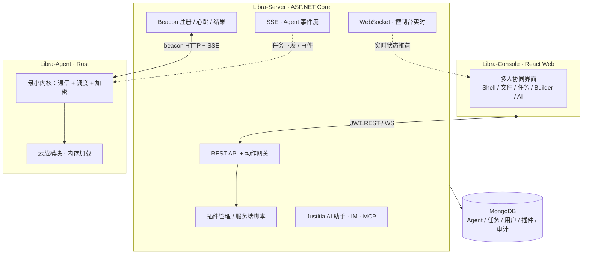

# Libra-Nextgen：开源红蓝对抗 C2 框架的架构与工程实践

> Libra-Nextgen 是一个开源的跨平台对抗模拟 / 红队 C2（Command & Control）框架，面向企业安全测试场景：Rust 编写的最小化 Agent、ASP.NET Core 服务端与 React Web 控制台。Agent 采用 Bootstrapper + 云载模块架构，能力按需从服务端下载并在内存中执行；通信走 beacon HTTP(S) + SSE 事件流，全链路 AES-256-GCM 加密。本文是它从架构到工程化的一次复盘。

---

## 1. 动机：为什么自己写一个 C2

做红蓝对抗演练时，用开源的现成 C2 是常见做法，但对我们来说一直有几个痛点：

1. **能力不可控**：想加一个自己的采集逻辑，要么写插件，要么 fork 整个仓库，而大部分 C2 的插件体系是给「人」用的，不是给「机器」用的。
2. **模块粒度太粗**：很多框架把能力打成一个大而全的载荷，目标机器上跑着的东西远超实际所需，更新一次能力要重新投递整个二进制。
3. **蓝队视角被忽略**：对抗演练的另一半是验证检测能力。我们希望生成的流量、行为是可编排、可解释的，方便蓝队在受控环境里建立检测基线——而不是一团"黑盒流量"。
4. **协同与审计缺失**：多人操作同一场演练时，谁在什么时间对哪台机器做了什么，需要完整留痕，这直接决定演练报告的严肃性。

Libra-Nextgen 就是围绕这几点设计的：**小而稳的 Agent 内核 + 按需云载的能力模块 + 以插件为单位的可交付能力 + 全员留痕的协作控制台**。

> 授权边界：本框架仅面向授权场景（自有资产、签署交战规则的红队行动、隔离实验环境）。全文只讨论工程与设计，不构成任何未授权使用指引。

---

## 2. 总体架构：三个进程，一条数据流



- **Libra-Agent（被控端）**：Rust，beacon 式通信，能力以模块形式按需从 Server 下载、内存执行、不落盘。
- **Libra-Server（服务端）**：ASP.NET Core WebAPI，负责注册握手、任务调度、模块下发、插件管理与数据持久化。
- **Libra-Console（控制端）**：React Web 控制台，多人协同操作；多人之间通过 WebSocket 实时同步状态。

值得强调的一点：**Agent 与 Server 之间没有 WebSocket**。Agent 的"实时"来自 SSE 事件流，WebSocket 只存在于控制台与 Server 之间。这个边界避免了两类客户端（人 vs 机器）共享同一套实时通道带来的复杂度。

---

## 3. Agent：最小内核与云载模块

### 3.1 Bootstrapper + Core + 云载模块

Agent 的加载链分三层：

```text
Bootstrapper（loader）── 下载/解密 Core ──▶ Core（最小内核）── 按需拉取 ──▶ 云载模块
```

- **Bootstrapper**：只负责一件事——携带一次性凭证，从 Server 取回并启动 Core。
- **Core**：只包含通信、调度与加密。任何新能力都不需要动它。
- **云载模块**：Shell、文件、PowerShell、凭据收集等都以独立模块存在，模块只在第一次被用到时才从 Server 下载，加载进内存直接执行。

这个模型带来的直接好处：载荷体积小、能力可增量演进、被控端的行为面可以按任务收敛。模块崩了由模块隔离兜底，不会带走整个进程——对 C2 这种"要长期存活"的软件来说，稳定性优先级很高。

### 3.2 双通道通信：beacon 轮询 + SSE 推送

Agent 与 Server 之间是两条互补的通道：

| 通道 | 方向 | 用途 | 为什么存在 |
|---|---|---|---|
| beacon HTTP(S) | 周期性上行 | 注册、心跳、结果上报、模块拉取 | 断线自愈的基础：网络抖动只丢一拍，不丢会话 |
| SSE 事件流 | 长连接下行 | 任务下发、实时事件 | 让"发任务"不必等下一个心跳窗口 |

心跳负责保活与兜底轮询，SSE 负责即时性。两条通道并行、互不阻塞，任务无论从哪条通道到达，都以任务 ID 去重。断线后按退避策略重连，会话丢失则自动重新注册——整个过程对使用者透明。

### 3.3 加密与流量形态（设计层面）

所有业务通信全链路 AES-256-GCM 加密，会话密钥通过 RSA 动态协商，注册握手本身也有独立的一次性加密保护，避免中间环节泄露主机信息。除此之外，框架提供可配置的**流量伪装 Profile**：请求路径、路径后缀、User-Agent、额外请求头、字段名、报文填充都可以整体配置，让 Agent 的网络特征不是"千篇一律的 C2 特征"，而是可以随演练场景调整。

这里想说的是设计取舍：加密解决"内容被读"，伪装解决"行为被识别"，两者是不同层的问题，不能互相替代。

### 3.4 模块的两种实现通道

云载模块支持两种形态：

- **script**：JavaScript 源码，在 Agent 内嵌的 QuickJS 沙箱里内存执行——**免编译**，改完即用，适合快速能力与演练脚本。
- **native**：Rust 编译的 cdylib，按平台目录分发，适合性能敏感或需要底层 API 的能力。

两种通道共享同一套 ABI 与调度框架，脚本里能拿到文件、进程、环境、命令执行等一套与平台解耦的 API，也支持运行时平台分支。对一个对抗模拟框架来说，"最快的路径是先写 20 行 JS 验证想法，成熟后再固化成 native 模块"这种演进路径很舒服。

---

## 4. Server：调度中枢与审计底座

Server 在技术上没有追逐花哨的微服务——它就是一个单体 WebAPI + MongoDB，理由很朴素：**对抗演练的部署环境常常是单机/内网，越少依赖越容易起**。

几个我认为值得写的设计：

- **任务即一等公民**：从创建、下发、执行到结果，任务有一个完整状态机，结果与执行过程都可回溯。插件动作、AI 工具调用最终都收敛成同一种任务。
- **审计只增不删**：所有操作指令写入只增的审计集合，前端没有任何删除入口。多人演练的"谁在何时对哪台机器做了什么"必须能回答。
- **JWT + RBAC**：Operator / Admin 分级，按权限点控制功能，AI 助手的工具调用同样过权限与审计。
- **云载模块的发布链**：模块产物按平台目录组织，Agent 按自身平台取对应产物；服务端有完整的版本一致性检查，避免"Agent 是新的、模块是旧的"这类静默不兼容。

---

## 5. Console：多人协同与在线构建

控制台是 React + HeroUI 的单页应用，覆盖 Agent 列表、终端、文件管理、任务与审计等页面。它只通过带 JWT 的 REST 与 WebSocket 和 Server 对话——**控制台不是 C2 的一部分，它只是 C2 的一个客户端**，这个心智模型让"再加一个客户端"变得容易。

值得一提的还有 **Builder**：在网页上选平台、选能力、填配置，就能在线产出 Agent 载荷，不需要操作者本地有 Rust 工具链。构建走"CI 预编译模板 + 服务端打包"的路径：模板由 CI 按版本发布并校验缓存，服务端只做注入与打包，把"发布新版本 Agent"从手工编译变成流水线动作。

---

## 6. 插件体系：把「能力」打包成 zip

如果云载模块是 Agent 的能力单元，插件体系就是**面向使用者的能力交付单元**。一个插件就是一个 zip：

```text
plugin.zip
├── meta.json      # 契约：声明 actions、参数 schema、module 引用
├── module/        # Agent 端能力：xxx.js（QuickJS）或 平台目录下的 dll/so
├── service/       # 服务端脚本（可选，服务端解析执行）
└── page/          # 控制台页面：纯 HTML+JS+CSS，运行时加载
```

几个设计要点：

- **契约驱动**：插件不写任何宿主代码，`meta.json` 声明"按钮 → 参数 → Agent 模块调用"的映射，动作网关校验后转成任务下发。插件作者不用理解任务系统。
- **页面零编译**：插件页面是纯 HTML+JS+CSS，被控制台放进沙箱 iframe 渲染，通过注入的 SDK 与宿主交互——导入新插件不需要重建控制台前端。
- **仓库边界**：插件源码维护在独立仓库（[Libra-Plugins](https://github.com/SmaZone2020/Libra-Plugins)），主仓库只含平台代码；插件通过 zip 导入或 Git 导入安装，支持插件市场索引。

这套边界带来一个很实际的工程收益：**平台与能力可以独立演进、独立发布**。平台迭代不阻塞插件，插件坏了也不影响平台稳定性。

---

## 7. AI 与生态：Justitia、IM 与 MCP

Server 内置 AI 助手 **Justitia**：它本质上是"带权限与审计的工具调用层"——AI 不是直接操作 Agent，而是通过受 RBAC 约束的工具（查 Agent、发任务、调插件动作）工作，每一步工具调用都进审计。

围绕它还有两件配套：

- **IM 频道**：Telegram / 微信 iLink / 飞书，让操作者在不打开控制台时也能经 IM 指挥 Justitia，支持绑定码、内联审批与群组调用。
- **MCP 服务器**：以 Streamable HTTP 暴露，外部 AI 客户端（IDE、Agent 框架）可以把整套操作作为工具接走。

个人看法：C2 的 AI 化，价值不在"AI 替我攻击"，而在**把重复的编排工作变成可审计的自然语言指令**。

---

## 8. 工程化：部署、发布与一致性

- **部署**：Docker 一键起整栈，控制台与 Agent 走同一入口，单端口对外；TLS 可配。本地开发则是 Mongo + dotnet + Vite 三件套。
- **发布一致性**：每次发版同步更新服务端版本常量、控制台包版本与更新日志——这三个"版本号事实源"必须在一个提交里完成，避免出现"刚发布的新版被误报为有新版可更"之类的低级事故。
- **文档**：以 `docs/` 为权威并与实现同步，中英双语；部署、操作、插件开发、平台矩阵都有对应文档。这对一个需要多人协作、多端（Agent/Server/Console/插件）对齐的框架是必要的投资。

---

## 9. 现状与局限（诚实的部分）

当前主平台是 **Windows x64**（全功能验证），**Linux x64** 已能交叉编译运行；ARM 平台与部分能力（如 win-arm64 上的脚本通道）仍在补齐中。框架假设了"服务端可达"的网络模型——这是 beacon 架构的固有前提，也意味着像纯离线隔离网这类场景需要额外的投递设计。

从工程复盘的角度，我更想强调的是另一个局限：**C2 框架的复杂度几乎全部集中在协议与状态的一致性上**。Agent、Server、控制台、插件四处各自演进时，任何一端对任务/会话语义的理解漂移，都会产生最难排查的那类"偶发失败"。这也是为什么我们把协议文档、版本事实源与平台矩阵当成一等交付物。

---

## 10. 结语

Libra-Nextgen 目前以 GPLv3 开源。回顾这个项目，我最满意的地方不是某个单点技术，而是它把"能力"做成了可以独立演进、可以被审计、可以被脚本化调用的资产——无论使用者是红队工程师、蓝队检测研究员，还是只想在受控环境里学习对抗技术的人，都能找到自己需要的那一层。

- 项目主页：[github.com/SmaZone2020/Libra-Nextgen](https://github.com/SmaZone2020/Libra-Nextgen)
- 插件脚手架：[Libra-Plugin-Template](https://github.com/SmaZone2020/Libra-Plugin-Template)
- 官方插件仓库：[Libra-Plugins](https://github.com/SmaZone2020/Libra-Plugins)

> 最后再提醒一次：本框架仅限授权场景使用（自有资产评估、签署交战规则的红队行动、隔离实验环境）。未经系统所有者明确书面授权，严禁对任何系统、网络或数据进行未授权访问。
